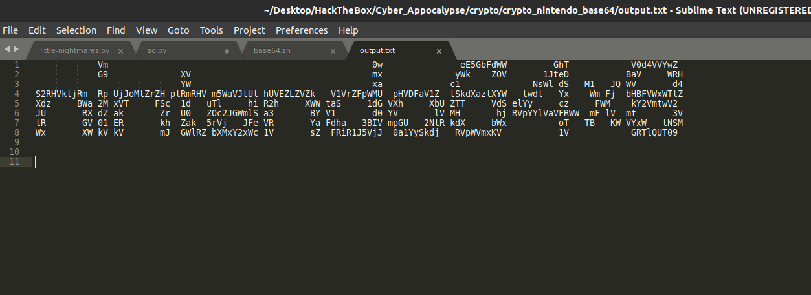
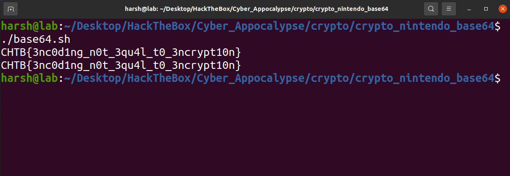

# Nintendo Base64
---
We were given a [file](output.txt) containing base64 encoded data.



## Solution
---
As the name suggests, the encoded data is in base64 format. So, I copied the data and used online [base64](www.base64decode.org) decoder.

It gave out another base64 encoded string, so I did it again.

Again, it gave me base64 encoded string. Then I realised that it is encoded 8 times as we can see in the images. So, I thought to automate this process by writing a simple bash script.

```bash
encoded_text="Vm0xNFlWVXhSWGxUV0doWVlrZFNWRmx0ZUdGalZsSlZWR3RPYWxKdGVIcFdiR2h2VkdzeFdGVnViRmRXTTFKeVdWUkdZV1JGT1ZWVmJGWk9WakpvV1ZaclpEUlVNVWw0Vkc1U1RsWnNXbGhWYkZKWFUxWmFSMWRzV2s1V2F6VkpWbTEwYjFkSFNsbFZiRkpXWWtaYU0xcEZXbUZTTVZaeVkwVTFWMDFHYjNkV2EyTXhWakpHVjFScmFGWmlhM0JYV1ZSR1lWZEdVbFZTYms1clVsUldTbGRyV2tkV2JGcEZVVlJWUFE9PQ=="
flag=$encoded_text

#Iterate until we find the flag
while true
do
	#To check whether the decoded text contains the flag format in it
	if grep "CHTB" <<< "$flag" 
	then
		echo "$flag"
		break
	fi
	#Updating the value of flag variable
	flag=$(echo "$flag" | base64 --decode) 
done
```

This gave me the flag : 



> **Flag** : _CHTB{3nc0d1ng_n0t_3qu4l_t0_3ncrypt10n}_
