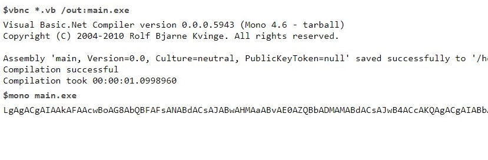
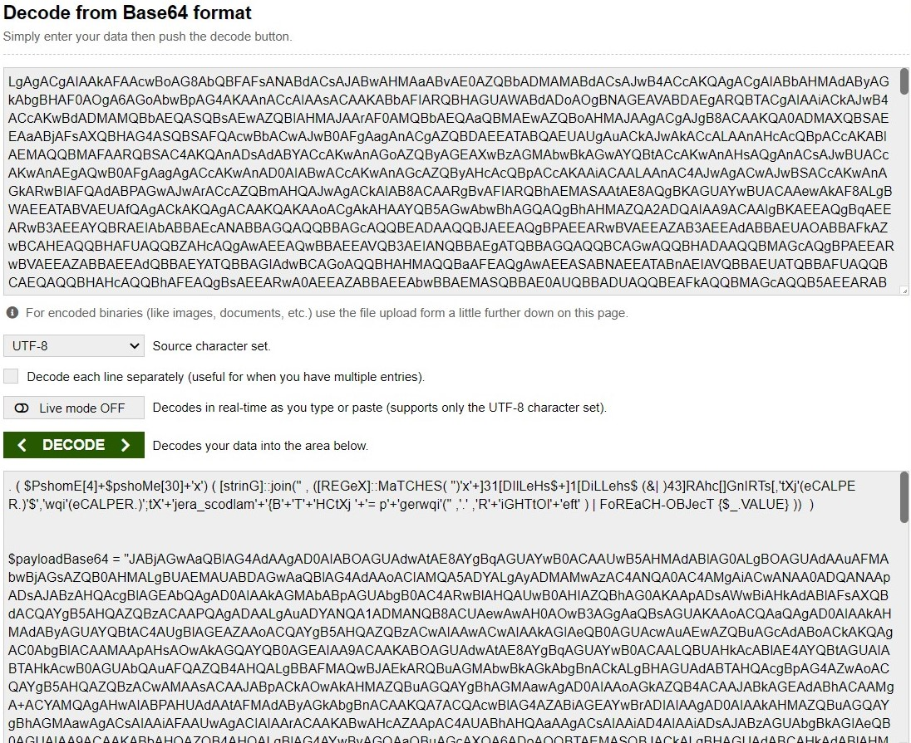
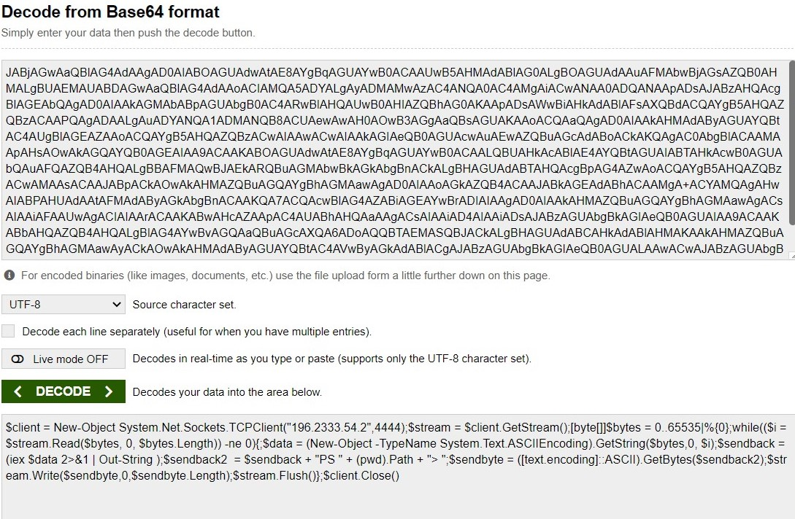

# Forensics

## 0x00 Invitation
---
_We were given [this](forensics_invitation.zip) Microsoft word file with **.docm** file extension._
### Solution
---
Basically, Microsoft fies with __.*x__ extension like **.docx**, **.pptx**, **.xlsx**, etc are compressed files, that means they can be opened with any zip archive software. Since, the extension is **.docm**, it clearly shows that it contains macros.  


A malicious code (generally in VBA) can be hidden inside these files.

>My first step was to extract macros form this file. We can use oletools but I will be using an online tool called [OnlineHashCrack](https://www.onlinehashcrack.com/tools-online-extract-vba-from-office-word-excel.php).


As I scroll through, I only see random function and variable names and it was obvious that the code was obfuscated. You can find the original file [here](sources/original.txt). I replaced the random variable and function names to more readable format. You can find the readable file [here](macro.txt).

>Now I tried to debug the code using an online debugger ([tutorialspoint.com](https://www.tutorialspoint.com/compile_vb.net_online.php)), then I printed the final command that was to be executed :


It gave `POWERSHELL.exe -noexit -w hidden -enc` and huge encoded text which, undoubtly was base64:



>Then I used an online [base64 decoder](base64decode.org).



At this point of time I was sure that it is executing powershell commands, we are also able to see some powershell variables and functions like `pshome` and `join()`, but still there is another layer of obfuscation as we can see **payloadBase64** variable which again, is base64 encoded. 

>Again after decoding we get:



We can clearly see that the code is trying to create a reverse shell to the attacker (in our case, ofcourse IP is invalid). But, still we do not get the flag : (


>Then I got back to initial code and try to debug the first line.
```powershell
. ( $PshomE[4]+$pshoMe[30]+'x') ( [strinG]::join('' , ([REGeX]::MaTCHES( ")'x'+]31[DIlLeHs$+]1[DiLLehs$ (&| )43]RAhc[]GnIRTs[,'tXj'(eCALPER.)'$','wqi'(eCALPER.)';tX'+'jera_scodlam'+'{B'+'T'+'HCtXj '+'= p'+'gerwqi'(" ,'.' ,'R'+'iGHTtOl'+'eft' ) | FoREaCH-OBJecT {$_.VALUE} ))  )
```

>As we remove unnecessary "+" and letter caps we instantly we see `righttoleft` method. We can use python to reverse the string.

```python
x = ")'x'+]31[DIlLeHs$+]1[DiLLehs$ (&| )43]RAhc[]GnIRTs[,'tXj'(ecalper.)'$','wqi'(ecalper.)';tXjera_scodlam{BTHCtXj = pgerwqi'("
print(x[::-1])
```

>Again by replacing unnecessary caps and "+" we get:

`"('iqwregp = jXtCHTB{maldocs_arejXt;').replace('iqw','$').replace('jXt',[string][char]34) |&( $shellid[1]+$shellid[13]+'x')"`
>We start to see our flag and by again debugging unnecessary replace we get:

```powershell
`"('$regp = jXtCHTB{maldocs_arejXt;').replace('jXt',[string][char]34) |&('iex')"`
```

> Flag 1 : CHTB{maldocs_are

>Similarly, we simplify this command:

```powershell
SEt ("G8"+"h")  (  " ) )63]Rahc[,'raZ'EcalPeR-  43]Rahc[,)05]Rahc[+87]Rahc[+94]Rahc[(  eCAlpERc-  )';2'+'N'+'1'+'}atem_we'+'n_eht'+'_2N1 = n'+'gerr'+'aZ'(( ( )''niOj-'x'+]3,1[)(GNirTSot.EcNereFeRpEsOBREv$ ( . "  ) ;-jOIn ( lS ("VAR"+"IaB"+"LE:g"+"8H")  ).VALue[ - 1.. - ( ( lS ("VAR"+"IaB"+"LE:g"+"8H")  ).VALue.LengtH)] | IeX 
```
This statement boils down to this:
```powershell
$regn = "_the_new_meta}";
```

>Flag 2 : _the_new_meta

>**Flag**:\
_CHTB{maldocs_are_the_new_meta}_

