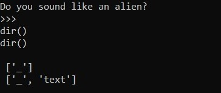
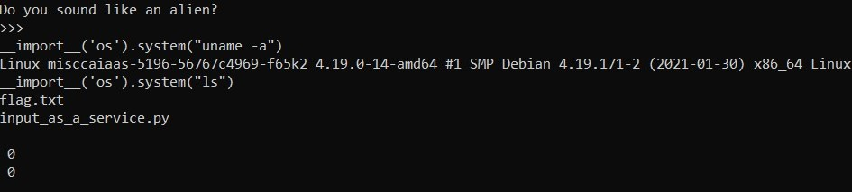

# Input as Service
*We were given ip address and port numer of the server running a  **python** program.*

## Solution
I Used `netcat` to connect to the server, it was running a python binary which was taking two inputs.

*I tried few things and found that it was using `exec()` function so I tried using `dir()` which resulted into :* 



It worked!

*So now I tried to import `os` and execute shell commands using this payload :*

```python
__import__(os).system("ls")
```


This proved RCE vulnerability as it returned the output of the shell command (also two numbers; probabily those are return values of `__import__` )

*Finally, used `cat` comand to get the flag :*

```python
__import__(os).system("cat flag.txt")
```


>**Flag :** _CHTB{4li3n5_us3_pyth0n2.X?!}_
