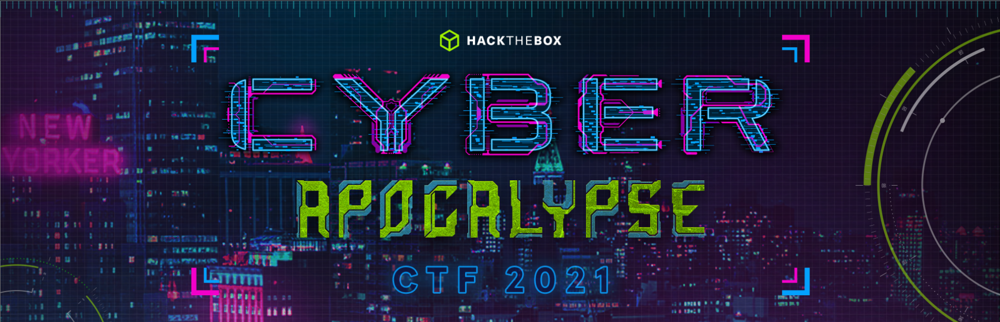

<h1 align="center">👽 Cyber Apocalypse 2021 👽</h1>

<i>This was a 5 day long CTF organized by Hack The Box which donated money for every challenge solved.</i>
 

## 👨‍💻 Categories
These challenges explored almost all topics required to start with cybersecurity. This event had almost **9,000** participants and **4,500+** teams. **Web exploitation** covered almost all topics which were foundation for modern web security. This CTF had a lot of Web and **Cryptography** challenges.

### 1. ️[Web](Web) 🕸 
### 2. [Crypto](Crypto) 🔑  
### 3. [Forensics](Forensics) 🕵️ 
### 4. [Reversing](Reversing) ↩️ 
### 5. [Hardware]() ⚙️ 
### 6. [Misc](Misc)  🐱‍👤 

## 📈 Conclusion
This CTF gave an opportunity to learn a lot and explore almost all kinds of fields. I loved **reverse engineering** and **forensics** categories. I had no idea about hardware challenges and now this has given me an opportunity to learn hardware. Also, it reflected how much I know and where I stand; still a lot to learn!
