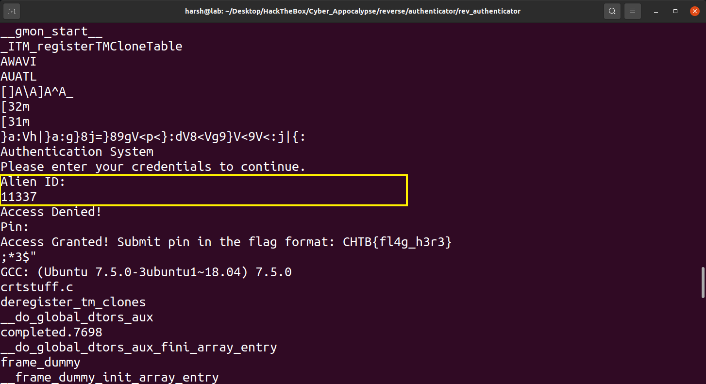
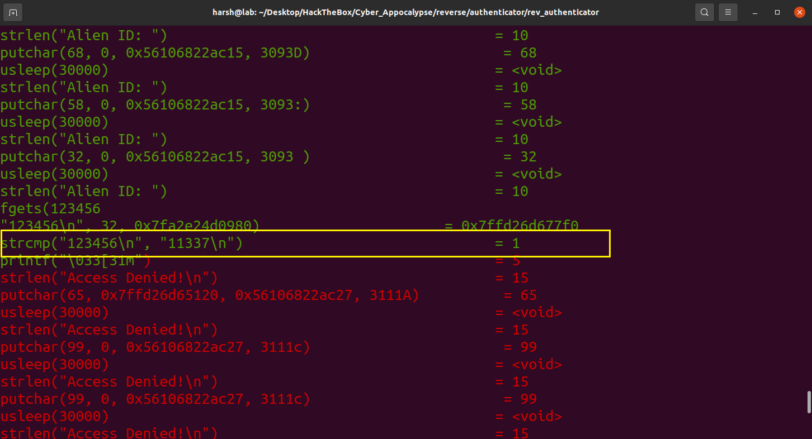
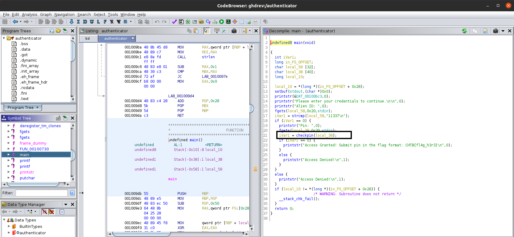

# Reversing
---
## 0x00 Authenticator
---
We were given a ELF64 binary which required a pin.


### Solution
---
This challenge seemed easy initially as it asked for an alien ID and running `strings` on the binary gave us the ID.



> Also, just to be sure I ran `ltrace` on it and confirmed the ID.



After entering the ID it asked for a PIN. I repeaded the `strings` and `ltarce` commands but this time I did not find anything. So, I opened `gdb` and tried to debug the program. Ultimately I found the flag but believe be this was very tedious task. So, instead of `gdb`, I fired up `Ghidra`.

> After loading the file in `Ghidra`, I opened `main` function and ghidra decompiled it for me  : 



> As we can see the decompiled code, it checks our previously found ID and then calls a function called `checkpin`. So I go to the `checkpin` function's defination.


> We can see that the each byte of the string is being XOR'd with "9". So I created a simple python script :

```python
x = "}a:Vh|}a:g}8j=}89gV<p<}:dV8<Vg9}V<9V<:j|{:"
k = 9
ans = ""
for i in x:
	ans += chr(ord(i) ^ k)
print(ans)
```

This gave me _rguy_

> **Flag** : _CHTB{}_

