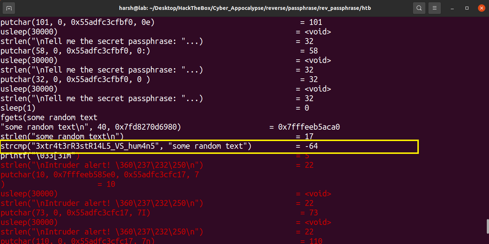

# Passphrase
We were given an ELF64 [binary](passphrase) which asked for a secret passphrase.

## Solution
This was a simple and straightforward challenge as it asks for a secret phrase which is hidden somewhere within the code. 

So, easy things first, I ran `strings` command on the binary to print all printable characters, but got nothing : (

Then I ran `ltrace` on the binary to check what library calls it is making, usually a `strcmp`(called when two strings are compared) is the ultimate and easiest call. 

> **Flag** : _CHTB{3xtr4t3rR3stR14L5_VS_hum4n5}_
